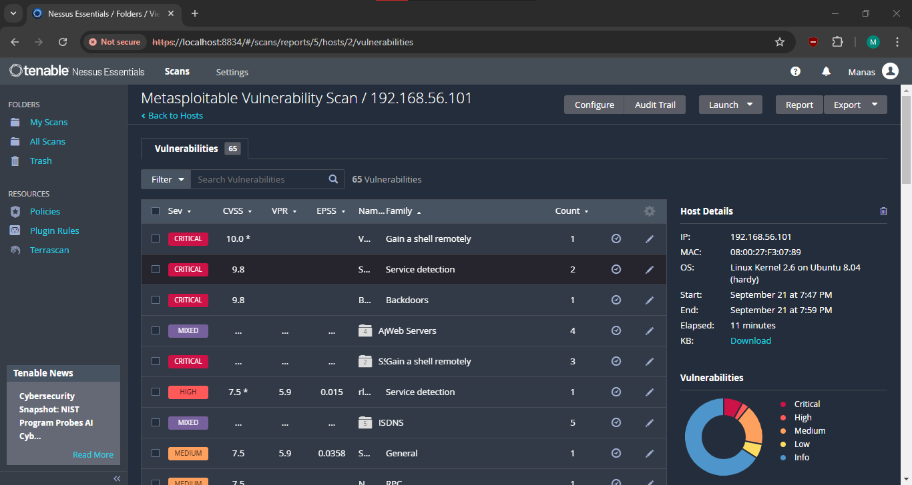

# Metasploitable-Nessus-Vulnerability-Assessment
Vulnerability assessment conducted using Nessus on Metasploitable virtual machine, highlighting key findings and remediation steps.

# Vulnerability Assessment of Metasploitable Using Nessus

## Project Overview
This project involves conducting a vulnerability assessment on **Metasploitable**, a deliberately vulnerable Linux virtual machine, using the **Nessus vulnerability scanner**. The goal of this project is to identify security vulnerabilities, understand their potential impact, and provide recommendations for remediation.

## Tools Used
- **Nessus**: A powerful vulnerability scanning tool used to detect potential security issues across networked systems.
- **Metasploitable**: A purposefully vulnerable Linux VM designed for security testing.
- **VirtualBox**: Virtualization software used to host the Metasploitable machine on a Windows host.
- **Host-Only Adapter**: Network configuration to allow direct communication between the host and VM.

## Project Steps
1. **Network Setup**: 
   - Configured Metasploitable with a host-only network on VirtualBox.
   - Ensured connectivity between Nessus (on the Windows host) and Metasploitable VM.
  
2. **Vulnerability Scanning**:
   - Conducted a **comprehensive scan** using Nessus.
   - Target: Metasploitable VM (IP: `192.168.X.X`).
   - Scanned for open ports, outdated software, and misconfigurations.

3. **Analysis**:
   - Identified **111 vulnerabilities**, including:
     - 7 **Critical**
     - 2 **High**
     - 21 **Medium**
     - 8 **Low**
     - 73 **Informational**
  
4. **Reporting**:
   - Generated a detailed PDF report highlighting key findings and recommendations.
   - Vulnerabilities were categorized based on severity and potential impact.

## Key Findings
### Critical Vulnerabilities
- **Apache Tomcat AJP Connector Request Injection (Ghostcat)** - [CVE-2020-1938](https://nvd.nist.gov/vuln/detail/CVE-2020-1938)
  - **CVSS Score**: 9.8
  - Allows unauthorized access to sensitive files or remote code execution via specially crafted requests.
  
- **Bind Shell Backdoor Detection**
  - **CVSS Score**: 9.8
  - Detection of a shell backdoor that could allow an attacker to gain full control of the system.

- **SSL Version 2 and 3 Protocol Detection**
  - **CVSS Score**: 9.8
  - Outdated SSL protocols that are vulnerable to several attacks, including **POODLE**.

- **Apache Tomcat SEoL (<= 5.5.x)**
  - **CVSS Score**: 10.0
  - A severe vulnerability in older versions of Apache Tomcat that allows remote code execution.

### High Vulnerabilities
- **ISC BIND Service Downgrade / Reflected DoS**
  - **CVSS Score**: 8.6
  - A vulnerability that can be exploited to cause denial-of-service or downgrade attacks on the BIND DNS server.

- **rlogin Service Detection**
  - **CVSS Score**: 7.5
  - The presence of an insecure remote login service (rlogin), which could allow attackers to intercept or alter communications.

### Medium Vulnerabilities
- **NFS Shares World Readable**
  - **CVSS Score**: 7.5
  - NFS shares on the target are readable by any user, exposing sensitive data.

- **Samba Badlock Vulnerability**
  - **CVSS Score**: 7.5
  - Vulnerability in Samba that could lead to privilege escalation or denial-of-service attacks.

### Full Vulnerability Report
The complete list of vulnerabilities, including all **Critical**, **High**, **Medium**, and **Informational** issues, can be found in the PDF report:
- [Report](report).

## Screenshots
To provide visual evidence and clarity, here are some screenshots of the Nessus scan setup, key results, and findings:
- **Nessus Scan Overview**: 
- **Critical Vulnerabilities**: 

## Lessons Learned
- **Vulnerability Assessment Process**: Gained experience in conducting systematic vulnerability scans using Nessus.
- **Network and System Configuration**: Understood how to set up virtual environments for security testing, focusing on network isolation and system access control.
- **Security Analysis**: Learned how to interpret vulnerability data, prioritize risks, and suggest effective remediation strategies based on severity and exploitability.
  
## Next Steps
- **Penetration Testing**: Use the vulnerabilities identified to perform exploitation using **Metasploit**.
- **System Hardening**: Research best practices to patch or mitigate identified issues in Metasploitable.
- **Further Learning**: Explore other vulnerability scanning tools (e.g., **OpenVAS**, **Nmap**) to compare results.
